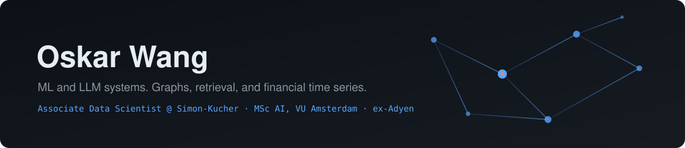

  
  
  

  
  
  
  
  

 

I build ML and LLM systems at Simon-Kucher in Amsterdam. Contract extraction, RAG, demand forecasting. Before that I spent four years catching fraud at Adyen, which is where I got hooked on data that has structure hiding in it.

 

## On the bench

| | Project | Stage |
|:--|:--|:--|
| 📰 | **ChronicleAI** · a RAG pipeline that wakes up every morning and writes me a newsletter | `🧪 Testing` |
| 🔮 | **Terminal Oracle** · a fortune-teller living in your terminal who remembers what you told her | `🛠 Building` |

 

## Selected work

<table>
<tr>
<td width="50%" valign="top">

### 📈 [TAGC · Stock Ranking](https://github.com/owhygithub/prj-1-TAGC-StockRanking-GNN-2026)
`PyTorch` `GNN` `Transformers`

MSc thesis. A transformer feeds a learned graph that figures out which stocks influence which, then ranks the S&P 500. The result was a clean negative, and I wrote it up as one.

</td>
<td width="50%" valign="top">

### 🕸 [AML Fraud Detection](https://github.com/owhygithub/prj-1-AMLFraudDetectionModel-DeepLearning-GNN-2024)
`PyTorch` `Temporal GNN`

BSc thesis. Tracking how laundering patterns move through a transaction network over time instead of scoring transactions one by one.

</td>
</tr>
<tr>
<td width="50%" valign="top">

### 📷 [oskarwang.com](https://github.com/owhygithub/prj-1-PhotographyWebsite-software-2025)
`JavaScript` `GitHub Pages`

My photography site. 210 photographs, no framework, no bundler, no dependencies. Thirty releases so far.

</td>
<td width="50%" valign="top">

### 🧭 More
Everything else lives in the repos. `prj-` is stuff I built, `uni-` is coursework, `course-` is self-study.

</td>
</tr>
</table>

 

<b>Beyond the code</b>

 

📷 &nbsp;Thirteen years of photography under [owhy.studio](https://oskarwang.com)

🎙 &nbsp;Co-host and producer of *Do You Belong?*, a podcast on identity and belonging

🗣 &nbsp;Czech, English, Mandarin, and enough Dutch for Amsterdam

